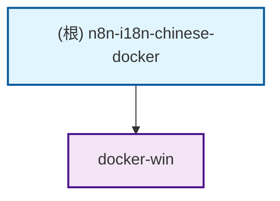

# n8n-i18n-chinese-docker 项目文档

## 变更记录 (Changelog)

### 2025-11-22
- 初始化项目文档
- 生成模块结构图
- 创建 docker-win 模块级文档
- 添加导航面包屑功能

## 项目愿景

构建和分发包含完整中文语言包和 FFmpeg 支持的 n8n Docker 镜像，为中文用户提供开箱即用的自动化工作流平台。项目基于上游中文语言包仓库，通过 GitHub Actions 自动化构建流程，确保用户能够获得最新版本的中文本地化 n8n 服务。

## 架构总览

### 技术架构
- **基础镜像**: 基于 `n8nio/n8n:${N8N_VERSION}` 官方镜像
- **构建方式**: 多阶段 Docker 构建，集成中文 UI 和 FFmpeg
- **自动化**: GitHub Actions 监控上游更新，自动构建发布
- **部署方案**: Docker Compose 一键部署，支持 Windows 和 Linux

### 核心特性
- 🔄 **自动同步**: 每小时检查上游更新，自动构建最新版本
- 🐳 **优化构建**: 多阶段 Docker 构建，镜像体积更小
- 🇨🇳 **完整中文**: 集成完整中文语言包，支持中文界面
- 🎬 **FFmpeg 支持**: 预装 FFmpeg，支持视频、音频处理工作流
- 🏢 **企业版支持**: 提供企业版镜像，启用所有企业级功能
- 🚀 **开箱即用**: Windows 一键启动，零配置部署

## 模块结构图



## 模块索引

| 模块路径 | 语言 | 主要职责 | 入口文件 | 测试目录 | 配置文件 |
|---------|------|----------|----------|----------|----------|
| `docker-win/` | Batch/PowerShell | Windows 优化部署方案 | `Start-ZH.bat` | ❌ 无 | `docker-compose-*.yml` |

## 运行与开发

### 环境要求
- Docker Desktop（Windows）或 Docker（Linux）
- Git（用于克隆项目）
- 可选：PowerShell（用于高级脚本功能）

### 快速启动

#### Windows 环境
```bash
# 克隆项目
git clone https://github.com/msola-ht/n8n-i18n-chinese-docker.git
cd n8n-i18n-chinese-docker/docker-win

# 中文用户推荐
Start-ZH.bat

# 或英文环境
Start-EN.bat
```

#### Linux/Mac 环境
```bash
# 克隆项目
git clone https://github.com/msola-ht/n8n-i18n-chinese-docker.git
cd n8n-i18n-chinese-docker/docker-win

# 中文版本
docker-compose -f docker-compose-cn.yml up -d

# 英文版本
docker-compose -f docker-compose-en.yml up -d
```

### 访问地址
- **Web UI**: http://127.0.0.1:5678
- **默认语言**: 中文（中文环境配置）/英文（英文环境配置）

## 测试策略

### 部署测试
- Docker Desktop 状态检查
- 容器启动和端口映射验证
- Web UI 访问测试
- 中文界面显示验证

### 功能测试
- 基础工作流创建和执行
- 文件输入输出功能测试
- FFmpeg 节点功能测试（如果有媒体文件）
- 数据持久化验证

### 自动化测试
- GitHub Actions 构建流程
- 镜像发布到 Docker Hub
- 版本同步机制验证

## 编码规范

### Docker 相关
- 使用官方 n8n 镜像作为基础
- 多阶段构建优化镜像大小
- 明确的镜像标签策略
- 环境变量命名采用大写加下划线

### 脚本规范
- Windows 批处理文件使用 UTF-8 编码
- 提供中英文双语版本
- 详细的错误检查和用户提示
- 操作步骤清晰分步骤展示

### 文档规范
- 中英文对照的配置说明
- 清晰的使用场景区分
- 常见问题解答（FAQ）
- 代码块和配置示例完整

## AI 使用指引

### 项目理解
- 这是一个基于官方 n8n 的中文本地化 Docker 镜像项目
- 核心价值在于自动化构建和简化部署
- 目标用户是需要中文界面的 n8n 用户

### 开发指导
- 优先考虑用户体验和部署简便性
- 保持与上游项目的同步更新
- 确保配置文件的安全性和可维护性
- 提供详细的使用文档和故障排除指南

### 修改建议
- 修改 Docker 构建流程需测试多环境兼容性
- 更新启动脚本需保持中英文版本一致性
- 添加新功能需考虑向后兼容性
- 文档更新需包含使用示例和故障排除

## 相关链接

- **官方项目**: https://github.com/n8n-io/n8n
- **上游中文包**: https://github.com/other-blowsnow/n8n-i18n-chinese
- **Docker Hub 镜像**: https://hub.docker.com/r/lunare/n8n-chinese
- **企业版镜像**: https://hub.docker.com/r/lunare/n8n-chinese-enterprise

## 许可证

本项目采用 MIT 许可证。